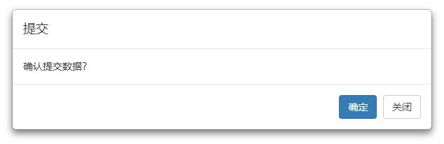
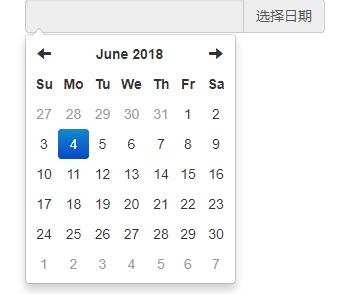
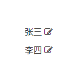
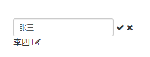
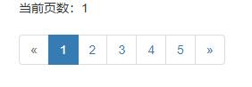

# angularJS1.x
记录项目中使用到的一些常用directive 小技巧等

### 常用Directive
**1.[提示弹出框(依赖Bootstrap)](demo/directive/alert-modal.html)**  
通过监听 `content` 内容的变化，触发提示弹出框。并在设定的时间 `close-time` 之后关闭提示框

  

**2.[确认弹出框(依赖Bootstrap)](demo/directive/confirm-modal.html)**  
通过监听 `content` 内容的变化，触发确认弹出框，可以在确认按钮绑定回调事件  

**3.[日期选择(依赖Bootstrap)](demo/directive/date-time-picker.html)**  
对dateTimePicker插件的二次封装，原插件地址[bootstrap-datetimepicker](http://www.bootcss.com/p/bootstrap-datetimepicker/)  
  

**4.[回车监听](demo/directive/enter-click.html)**  
对回车键添加监听，点击时触发事件  
  
**5.[input-group](demo/directive/input-group.html)**  
默认显示文本，点击icon进入编辑状态，出现input输入框（支持回车键执行回调事件）  
  
  
  

**6.[input-number](demo/directive/input-number.html)**  
限制文本框只能输入数字，可设置最小值和最大值，通过 `key up` 事件监听当1.5秒内没有输入则执行回调函数
  
**7.[pagination](demo/directive/pagination.html)**  
分页管理，通过每页显示数量/总item数/当前页数实现分页管理  
  
